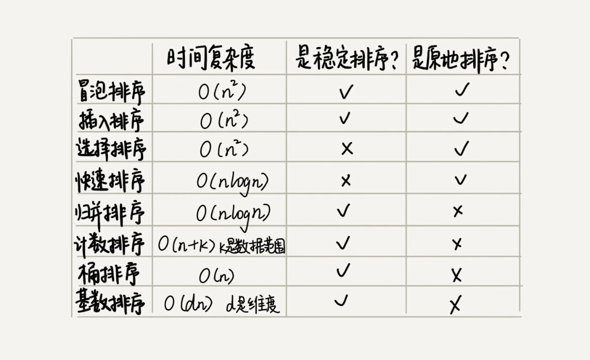
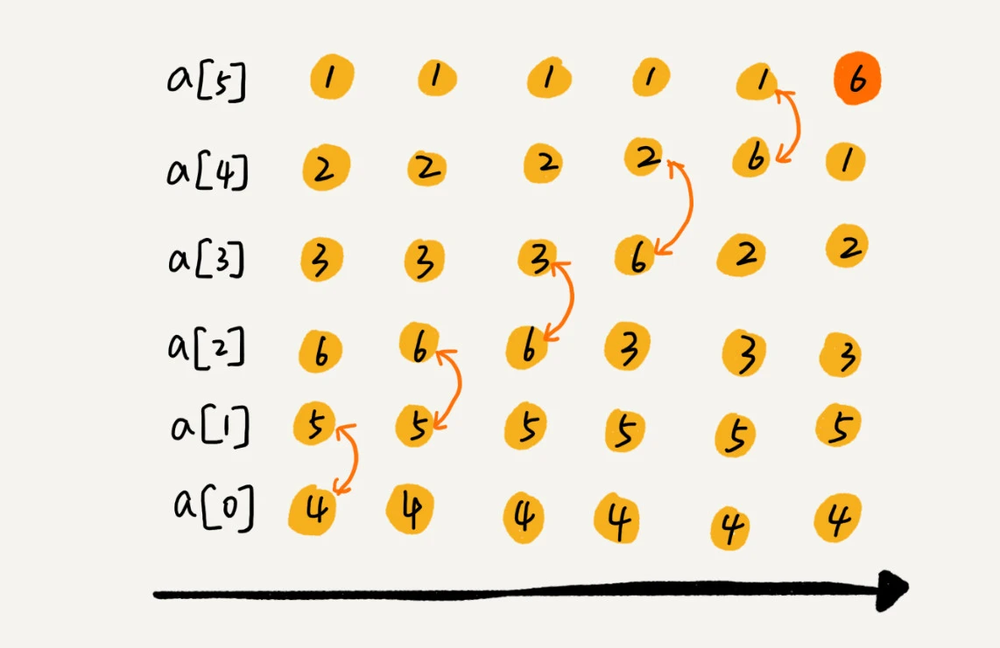
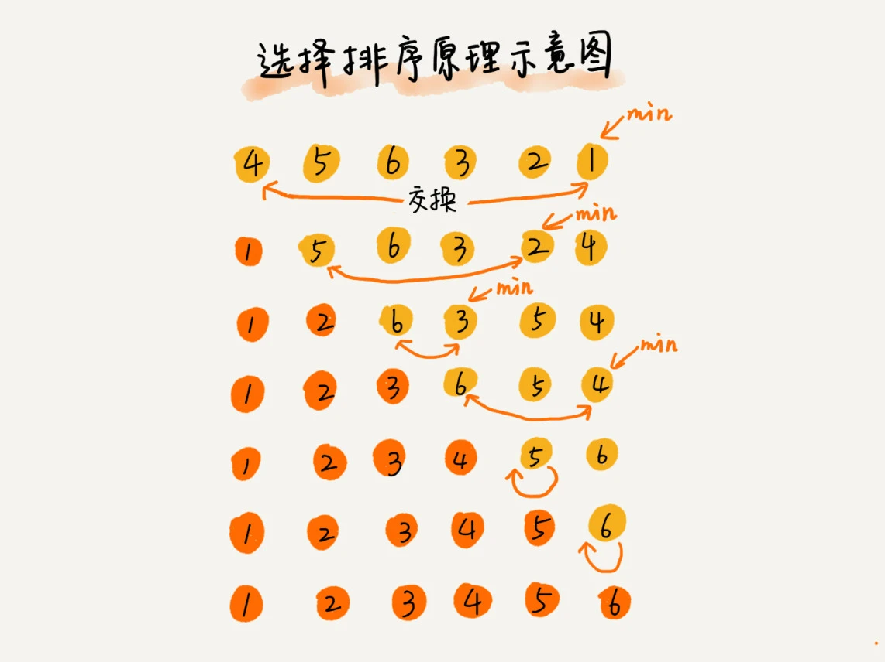

= 排序 sort

== n^2

. 冒泡

    两个两个比，大的、小的放后面

. 插入

    一个值和插到去比它大的前面去

. 选择排序

    从未排序的部分中取出最小、最大的值，放到已排序部分的末尾

== nlogn

快排和堆排序这两种排序算法的时间复杂度都是 O(nlogn)，甚至堆排序比快速排序的时间复杂度还要稳定，但是，在实际的软件开发中，快速排序的性能要比堆排序好

. 快速排序

    选择第一个作为中间值，前一个指针后一个指针，根据大小和第一个值做位置交换

. 归并

    分成小段，每个排好序的小段排序合并

== n

. 桶

    核心思想是将要排序的数据分到几个有序的桶里，每个桶里的数据再单独进行排序。桶内排完序之后，再把每个桶里的数据按照顺序依次取出，组成的序列就是有序的了。

. 计数
. 基数
